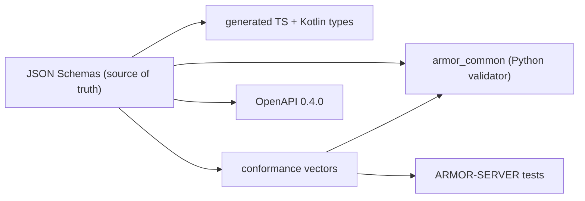

<p align="center">
  
</p>

# 📐 ARMOR-COMMON

<p align="center">🇺🇸 <b>English</b> | <a href="README_spa.md">🇪🇸 Español</a></p>

### 🧾 Message Contracts, Validation & Shared Project Launcher

<p align="center">
  
  
  
  
</p>

---

**Honesty check - what runs today:** the schemas, the Python validator, the 50 shared conformance vectors, the generated TypeScript and Kotlin types and the shared project launcher are real and tested. The Kotlin file is generated but **not yet consumed** by ARMOR-ANDROID-CONTROL, and the `set_thresholds` command carries a single `sensitivity` field because the real radar parameters are not defined until firmware exists.

---

## 1. 🛠️ OVERVIEW

**ARMOR-COMMON** owns what every A.R.M.O.R. message means. Radar nodes and the simulator produce these messages; the server, the visual AI and the voice service consume them. If two projects disagree about a field, this repository decides.

* 📜 **One source of truth:** JSON Schemas in `src/armor_common/schemas/` (telemetry, health, command). Unknown fields are rejected everywhere.
* ✅ **A validator that cannot skip a rule:** it interprets the schema directly and refuses a schema that uses a keyword it does not implement.
* 🤝 **Conformance vectors:** 50 accepted/rejected payloads run by every implementation (Python here, TypeScript in ARMOR-SERVER), so drift fails a build.
* 🧬 **Generated clients:** TypeScript and Kotlin types come from the schemas (`tools/generate_types.py --check` keeps them current).
* 🌐 **HTTP contract:** `openapi/armor-server-0.4.0.yaml` describes every server route, its access rule and its schema.
* 🚀 **Shared launcher:** `tools/armor_project_tool.py` gives all eleven repositories the same `build`, `build-test` and `run` workflow.

---

## 2. 🔄 ARCHITECTURE



Broker topics: `armor/node/{node_id}/telemetry | health | command`. See [contracts](docs/CONTRACTS.md).

---

## 3. 🔧 BUILD & TEST

```powershell
python -m pip install -e .
python -m unittest discover -s tests      # 16 tests, 50 conformance vectors
python tools/generate_types.py --check    # generated types are current
python tools/make_conformance.py          # regenerate the vectors after editing the case list
```

The shared launcher creates an ignored `.env` on the first ARMOR-SERVER run with random ingest, control, operator and camera-key secrets, plus an `admin` Studio user and a random password. Nothing is printed or committed; read or replace those values only in the server's `.env`.

---

## 📂 DIRECTORY STRUCTURE

```text
ARMOR-COMMON/
├── src/armor_common/   contracts, schema (validator), envelope, schemas/*.json
├── conformance/        accepted and rejected payloads shared by every implementation
├── generated/          TypeScript and Kotlin types (generated, do not edit)
├── openapi/            armor-server-0.4.0.yaml
├── tools/              armor_project_tool.py, generate_types.py, make_conformance.py
├── tests/              unit tests and conformance runner
└── docs/               contracts guide
```

---

## 👤 AUTHOR

**JuanenRac (Electro Hobby 3D)** · electrohobby3d@gmail.com

## 📜 LICENSE

GPL-3.0-or-later - see [LICENSE](LICENSE).
