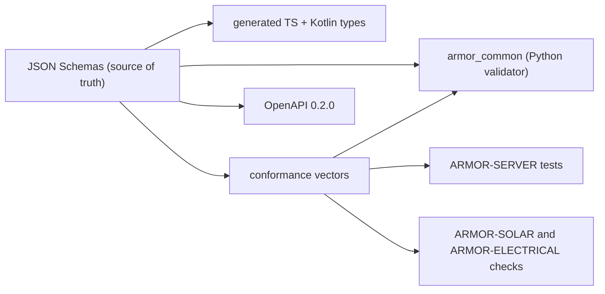

<p align="center">
  
</p>

# 🧾 ARMOR-COMMON

<p align="center">
  🇺🇸 <b>English</b> |
  <a href="README_spa.md">🇪🇸 Español</a> |
  <a href="README_fra.md">🇫🇷 Français</a> |
  <a href="README_ita.md">🇮🇹 Italiano</a> |
  <a href="README_deu.md">🇩🇪 Deutsch</a> |
  <a href="README_zho.md">🇨🇳 简体中文</a> |
  <a href="README_jpn.md">🇯🇵 日本語</a>
</p>

### Message contracts, validation and the shared project launcher

<p align="center">
  
  
  
  
  
</p>

---

**Honesty check - what runs today:** The schemas, the Python validator, the 330 shared conformance vectors, the generated TypeScript and Kotlin types and the shared project launcher are real and tested (36 tests). The Kotlin file is generated but **not yet consumed** by ARMOR-ANDROID-CONTROL, and the `set_thresholds` command carries a single `sensitivity` field because the real radar parameters are not defined until firmware exists.

---

## 🎯 Overview

**ARMOR-COMMON** owns what every A.R.M.O.R. message means. Radar nodes, solar gateway nodes and the simulator produce these messages; the server, the visual AI and the voice service consume them. If two projects disagree about a field, this repository decides.

* **One source of truth:** JSON Schemas in `src/armor_common/schemas/` for telemetry, health, command, node information and the two solar messages (inverter, battery with cells and capacities). Unknown fields are rejected everywhere.
* **A validator that cannot skip a rule:** it interprets the schema directly and refuses a schema that uses a keyword it does not implement.
* **Conformance vectors:** 330 accepted and rejected payloads run by every implementation (Python here, TypeScript in ARMOR-SERVER, the checks of ARMOR-SOLAR), so drift fails a build.
* **Generated clients:** TypeScript and Kotlin types come from the schemas (`tools/generate_types.py --check` keeps them current).
* **HTTP contract:** `openapi/armor-server-0.4.0.yaml` describes every server route, its access rule and its schema.
* **Shared launcher:** `tools/armor_project_tool.py` gives every repository of the family the same `build`, `build-test` and `run` workflow.

## 🔄 Architecture



## 📂 Repository Structure

```text
ARMOR-COMMON/
├── src/armor_common/   contracts, schema (validator), envelope, schemas/*.json (telemetry, health, command, info, solar_inverter, solar_battery, electrical)
├── conformance/        accepted and rejected payloads shared by every implementation
├── firmware_base/      the firmware that ARMOR-RADAR, ARMOR-SOLAR and ARMOR-ELECTRICAL share, once (synced into each by tools/sync_firmware_base.py)
├── generated/          TypeScript and Kotlin types (generated, do not edit)
├── openapi/            armor-server-0.4.0.yaml
├── tools/              armor_project_tool.py, generate_types.py, make_conformance.py, sync_firmware_base.py
├── tests/              unit tests and conformance runner
└── docs/               contracts guide, the shared firmware base
```

## 🛠️ Development Environment

```powershell
python -m pip install -e .
python -m unittest discover -s tests      # 39 tests, 330 conformance vectors
python tools/generate_types.py --check    # generated types are current
python tools/make_conformance.py          # regenerate the vectors after editing the case list
python tools/sync_firmware_base.py check  # the firmware the node projects share has not drifted (see docs/FIRMWARE_BASE.md)
```

Broker topics: `armor/node/{node_id}/telemetry | health | command | info`, `armor/solar/{node_id}/{device}/state` and `armor/electrical/{node_id}/state | command | result`. See the [contracts guide](docs/CONTRACTS.md). The shared launcher creates an ignored `.env` on the first ARMOR-SERVER run with random secrets and a random administrator password; nothing is printed or committed.

## 🔗 Related Projects

**A.R.M.O.R.** (Autonomous Radar & Multimodal Observation Range) is a perimeter-security system made of independent repositories. Each one has its own version, its own tests and its own README; this is the family:

* **ARMOR-COMMON** (this repository) - Message contracts, validators, conformance vectors and generated types
* **[ARMOR-RADAR](https://github.com/JuanenRac/ARMOR-RADAR)** - Field-node firmware for ESP32-S3 with three radars and its own web panel
* **[ARMOR-SOLAR](https://github.com/JuanenRac/ARMOR-SOLAR)** - Solar inverter and battery protocols and the messages of a gateway node
* **[ARMOR-ELECTRICAL](https://github.com/JuanenRac/ARMOR-ELECTRICAL)** - Electrical node: meters, the message of the network's readings and the rules for switching
* **[ARMOR-HMI](https://github.com/JuanenRac/ARMOR-HMI)** - Touch panel: the state of the system on a wall screen, arming and acknowledging, and the home of the voice assistant
* **[ARMOR-NETWORK](https://github.com/JuanenRac/ARMOR-NETWORK)** - The local network: its devices, the internet and what changes
* **[ARMOR-SERVER](https://github.com/JuanenRac/ARMOR-SERVER)** - Central coordinator: telemetry, alarms, devices, solar readings and cameras
* **[ARMOR-STUDIO](https://github.com/JuanenRac/ARMOR-STUDIO)** - Web console: cameras, radar, alarms, solar energy and the 2D/3D site designer
* **[ARMOR-ANDROID-CONTROL](https://github.com/JuanenRac/ARMOR-ANDROID-CONTROL)** - Android operator client with a live 2D/3D radar
* **[ARMOR-SERVER-AI](https://github.com/JuanenRac/ARMOR-SERVER-AI)** - Visual inference policy that explains its decisions and never actuates
* **[ARMOR-VOICE-AI](https://github.com/JuanenRac/ARMOR-VOICE-AI)** - Offline voice intents with a confirmation that cannot be forged
* **[ARMOR-HARDWARE](https://github.com/JuanenRac/ARMOR-HARDWARE)** - Enclosures, electronics and the bench acceptance matrix
* **[ARMOR-DEVOPS](https://github.com/JuanenRac/ARMOR-DEVOPS)** - Deployment, the CM5 test bench, backup and TLS
* **[ARMOR-SIMULATOR](https://github.com/JuanenRac/ARMOR-SIMULATOR)** - Offline telemetry simulator with repeatable faults
* **[ARMOR-UPDATER](https://github.com/JuanenRac/ARMOR-UPDATER)** - Detects, installs and updates the ecosystem's own repositories
* **[ARMOR-DOCS](https://github.com/JuanenRac/ARMOR-DOCS)** - Architecture, security baseline and the capability matrix

## 📚 Documentation & Community

Where to read more:

* [Capability matrix: what is proven and what is not](https://github.com/JuanenRac/ARMOR-DOCS/blob/main/docs/CAPABILITY_MATRIX.md)
* [Project catalogue: versions and how the repositories depend on each other](https://github.com/JuanenRac/ARMOR-DOCS/blob/main/docs/PROJECT_CATALOG.md)
* [Changelog of this repository](CHANGELOG.md)
* [License (GPL-3.0-or-later)](LICENSE)
* Questions, ideas and reports: electrohobby3d@gmail.com

## 👤 AUTHOR

**JuanenRac (Electro Hobby 3D)** · electrohobby3d@gmail.com

## 📜 LICENSE

GPL-3.0-or-later - see [LICENSE](LICENSE).
