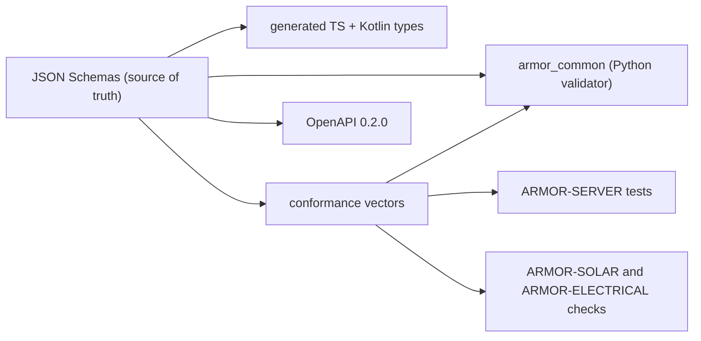

<p align="center">
  
</p>

# 🧾 ARMOR-COMMON

<p align="center">
  <a href="README.md">🇺🇸 English</a> |
  <a href="README_spa.md">🇪🇸 Español</a> |
  <a href="README_fra.md">🇫🇷 Français</a> |
  <a href="README_ita.md">🇮🇹 Italiano</a> |
  🇩🇪 <b>Deutsch</b> |
  <a href="README_zho.md">🇨🇳 简体中文</a> |
  <a href="README_jpn.md">🇯🇵 日本語</a>
</p>

### Nachrichtenverträge, Validierung und der gemeinsame Projektstarter

<p align="center">
  
  
  
  
  
</p>

---

**Ehrlichkeitsprüfung - was heute läuft:** Die Schemas, der Python-Validierer, die 330 gemeinsamen Konformitätsvektoren, die generierten TypeScript- und Kotlin-Typen und der gemeinsame Projektstarter sind real und getestet (39 Tests). Die Kotlin-Datei ist generiert, wird aber von ARMOR-ANDROID-CONTROL **noch nicht verwendet**, und der Befehl `set_thresholds` trägt nur ein Feld `sensitivity`, weil die echten Radarparameter erst definiert werden, wenn es Firmware gibt.

---

## 🎯 Überblick

**ARMOR-COMMON** besitzt die Bedeutung jeder A.R.M.O.R.-Nachricht. Radarknoten, Solar-Gateway-Knoten und der Simulator erzeugen diese Nachrichten; der Server, die visuelle KI und der Sprachdienst verbrauchen sie. Wenn zwei Projekte über ein Feld uneins sind, entscheidet dieses Repository.

* **Eine einzige Wahrheitsquelle:** JSON-Schemas in `src/armor_common/schemas/` für Telemetrie, Zustand, Befehl, Knoteninformation und die zwei Solarnachrichten (Wechselrichter, Batterie mit Zellen und Kapazitäten). Unbekannte Felder werden überall abgelehnt.
* **Ein Validierer, der keine Regel überspringen kann:** er interpretiert das Schema direkt und lehnt ein Schema ab, das ein nicht implementiertes Schlüsselwort nutzt.
* **Konformitätsvektoren:** 330 akzeptierte und abgelehnte Nutzlasten, von jeder Implementierung ausgeführt (hier Python, TypeScript in ARMOR-SERVER, die Prüfungen von ARMOR-SOLAR), sodass Abweichung den Build scheitern lässt.
* **Generierte Clients:** TypeScript- und Kotlin-Typen entstehen aus den Schemas (`tools/generate_types.py --check` hält sie aktuell).
* **HTTP-Vertrag:** `openapi/armor-server-0.4.2.yaml` beschreibt jede Serverroute, ihre Zugriffsregel und ihr Schema.
* **Gemeinsamer Starter:** `tools/armor_project_tool.py` gibt jedem Repository der Familie denselben Ablauf `build`, `build-test` und `run`.

## 🔄 Architektur



## 📂 Struktur des Repositorys

```text
ARMOR-COMMON/
├── src/armor_common/   contracts, schema (validator), envelope, schemas/*.json (telemetry, health, command, info, solar_inverter, solar_battery, electrical)
├── conformance/        accepted and rejected payloads shared by every implementation
├── firmware_base/      the firmware that ARMOR-RADAR, ARMOR-SOLAR and ARMOR-ELECTRICAL share, once (synced into each by tools/sync_firmware_base.py)
├── generated/          TypeScript and Kotlin types (generated, do not edit)
├── openapi/            armor-server-0.4.2.yaml
├── tools/              armor_project_tool.py, generate_types.py, make_conformance.py, sync_firmware_base.py
├── tests/              unit tests and conformance runner
└── docs/               contracts guide, the shared firmware base
```

## 🛠️ Entwicklungsumgebung

```powershell
python -m pip install -e .
python -m unittest discover -s tests      # 39 tests, 330 conformance vectors
python tools/generate_types.py --check    # generated types are current
python tools/make_conformance.py          # regenerate the vectors after editing the case list
python tools/sync_firmware_base.py check  # the firmware the node projects share has not drifted (see docs/FIRMWARE_BASE.md)
```

Broker-Topics: `armor/node/{node_id}/telemetry | health | command | info`, `armor/solar/{node_id}/{device}/state` und `armor/electrical/{node_id}/state | command | result`. Siehe den [Vertragsleitfaden](docs/CONTRACTS.md). Der gemeinsame Starter erzeugt beim ersten ARMOR-SERVER-Lauf eine ignorierte `.env` mit zufälligen Geheimnissen und einem zufälligen Administratorpasswort; nichts wird gedruckt oder eingecheckt.

## 🔗 Verwandte Projekte

**A.R.M.O.R.** (Autonomous Radar & Multimodal Observation Range) ist ein Perimeter-Sicherheitssystem aus unabhängigen Repositorys. Jedes hat eine eigene Version, eigene Tests und ein eigenes README; hier ist die Familie:

* **ARMOR-COMMON** (dieses Repository) - Nachrichtenverträge, Validierer, Konformitätsvektoren und generierte Typen
* **[ARMOR-RADAR](https://github.com/JuanenRac/ARMOR-RADAR)** - Feldknoten-Firmware für ESP32-S3 mit drei Radaren und eigenem Web-Panel
* **[ARMOR-SOLAR](https://github.com/JuanenRac/ARMOR-SOLAR)** - Protokolle für Solar-Wechselrichter und -Batterien und die Nachrichten eines Gateway-Knotens
* **[ARMOR-ELECTRICAL](https://github.com/JuanenRac/ARMOR-ELECTRICAL)** - Elektroknoten: Zähler, die Nachricht der Netzmesswerte und die Regeln fürs Schalten
* **[ARMOR-HMI](https://github.com/JuanenRac/ARMOR-HMI)** - Touch-Panel: der Systemzustand auf einem Wandbildschirm, Scharf- und Quittieren sowie das Zuhause des Sprachassistenten
* **[ARMOR-NETWORK](https://github.com/JuanenRac/ARMOR-NETWORK)** - Das lokale Netzwerk: seine Geräte, das Internet und was sich ändert
* **[ARMOR-SERVER](https://github.com/JuanenRac/ARMOR-SERVER)** - Zentraler Koordinator: Telemetrie, Alarme, Geräte, Solarmesswerte und Kameras
* **[ARMOR-STUDIO](https://github.com/JuanenRac/ARMOR-STUDIO)** - Web-Konsole: Kameras, Radar, Alarme, Solarenergie und 2D/3D-Standortdesigner
* **[ARMOR-ANDROID-CONTROL](https://github.com/JuanenRac/ARMOR-ANDROID-CONTROL)** - Android-Bedienclient mit Live-Radar in 2D/3D
* **[ARMOR-SERVER-AI](https://github.com/JuanenRac/ARMOR-SERVER-AI)** - Visuelle Inferenzrichtlinie, die ihre Entscheidungen erklärt und nie handelt
* **[ARMOR-VOICE-AI](https://github.com/JuanenRac/ARMOR-VOICE-AI)** - Offline-Sprachabsichten mit einer nicht fälschbaren Bestätigung
* **[ARMOR-HARDWARE](https://github.com/JuanenRac/ARMOR-HARDWARE)** - Gehäuse, Elektronik und die Abnahmematrix am Prüfstand
* **[ARMOR-DEVOPS](https://github.com/JuanenRac/ARMOR-DEVOPS)** - Bereitstellung, CM5-Prüfstand, Backup und TLS
* **[ARMOR-SIMULATOR](https://github.com/JuanenRac/ARMOR-SIMULATOR)** - Offline-Telemetriesimulator mit wiederholbaren Fehlern
* **[ARMOR-UPDATER](https://github.com/JuanenRac/ARMOR-UPDATER)** - Erkennt, installiert und aktualisiert die eigenen Repositories des Ökosystems
* **[ARMOR-DOCS](https://github.com/JuanenRac/ARMOR-DOCS)** - Architektur, Sicherheitsgrundlage und die Fähigkeitsmatrix

## 📚 Dokumentation und Community

Hier gibt es mehr zu lesen:

* [Fähigkeitsmatrix: was belegt ist und was nicht](https://github.com/JuanenRac/ARMOR-DOCS/blob/main/docs/CAPABILITY_MATRIX.md)
* [Projektkatalog: Versionen und wie die Repositorys voneinander abhängen](https://github.com/JuanenRac/ARMOR-DOCS/blob/main/docs/PROJECT_CATALOG.md)
* [Änderungsverlauf dieses Repositorys](CHANGELOG.md)
* [Lizenz (GPL-3.0-or-later)](LICENSE)
* Fragen, Ideen und Meldungen: electrohobby3d@gmail.com

## 👤 AUTOR

**JuanenRac (Electro Hobby 3D)** · electrohobby3d@gmail.com

## 📜 LIZENZ

GPL-3.0-or-later - siehe [LICENSE](LICENSE).
