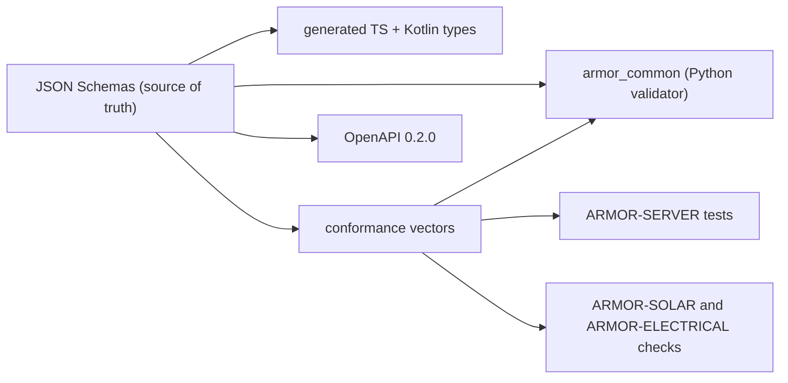

<p align="center">
  
</p>

# 🧾 ARMOR-COMMON

<p align="center">
  <a href="README.md">🇺🇸 English</a> |
  <a href="README_spa.md">🇪🇸 Español</a> |
  🇫🇷 <b>Français</b> |
  <a href="README_ita.md">🇮🇹 Italiano</a> |
  <a href="README_deu.md">🇩🇪 Deutsch</a> |
  <a href="README_zho.md">🇨🇳 简体中文</a> |
  <a href="README_jpn.md">🇯🇵 日本語</a>
</p>

### Contrats de messages, validation et lanceur de projets partagé

<p align="center">
  
  
  
  
  
</p>

---

**Vérification d'honnêteté - ce qui fonctionne aujourd'hui:** Les schémas, le validateur Python, les 330 vecteurs de conformité partagés, les types TypeScript et Kotlin générés et le lanceur de projets partagé sont réels et testés (36 tests). Le fichier Kotlin est généré mais **pas encore utilisé** par ARMOR-ANDROID-CONTROL, et la commande `set_thresholds` ne porte qu'un champ `sensitivity` car les vrais paramètres du radar ne sont pas définis tant que le firmware n'existe pas.

---

## 🎯 Présentation

**ARMOR-COMMON** possède le sens de chaque message d'A.R.M.O.R. Les nœuds radar, les nœuds passerelles solaires et le simulateur produisent ces messages ; le serveur, l'IA visuelle et le service vocal les consomment. Si deux projets divergent sur un champ, ce dépôt tranche.

* **Une seule source de vérité :** des schémas JSON dans `src/armor_common/schemas/` pour la télémétrie, la santé, la commande, l'information du nœud et les deux messages solaires (onduleur, batterie avec cellules et capacités). Les champs inconnus sont rejetés partout.
* **Un validateur qui ne peut sauter aucune règle :** il interprète directement le schéma et refuse un schéma qui utilise un mot-clé qu'il n'implémente pas.
* **Vecteurs de conformité :** 330 charges acceptées et rejetées exécutées par chaque implémentation (Python ici, TypeScript dans ARMOR-SERVER, les contrôles d'ARMOR-SOLAR), si bien qu'une dérive fait échouer la compilation.
* **Clients générés :** les types TypeScript et Kotlin sortent des schémas (`tools/generate_types.py --check` les tient à jour).
* **Contrat HTTP :** `openapi/armor-server-0.2.0.yaml` décrit chaque route du serveur, sa règle d'accès et son schéma.
* **Lanceur partagé :** `tools/armor_project_tool.py` donne à tous les dépôts de la famille le même flux `build`, `build-test` et `run`.

## 🔄 Architecture



## 📂 Structure du dépôt

```text
ARMOR-COMMON/
├── src/armor_common/   contracts, schema (validator), envelope, schemas/*.json (telemetry, health, command, info, solar_inverter, solar_battery, electrical)
├── conformance/        accepted and rejected payloads shared by every implementation
├── firmware_base/      the firmware that ARMOR-RADAR, ARMOR-SOLAR and ARMOR-ELECTRICAL share, once (synced into each by tools/sync_firmware_base.py)
├── generated/          TypeScript and Kotlin types (generated, do not edit)
├── openapi/            armor-server-0.2.0.yaml
├── tools/              armor_project_tool.py, generate_types.py, make_conformance.py, sync_firmware_base.py
├── tests/              unit tests and conformance runner
└── docs/               contracts guide, the shared firmware base
```

## 🛠️ Environnement de développement

```powershell
python -m pip install -e .
python -m unittest discover -s tests      # 39 tests, 330 conformance vectors
python tools/generate_types.py --check    # generated types are current
python tools/make_conformance.py          # regenerate the vectors after editing the case list
python tools/sync_firmware_base.py check  # the firmware the node projects share has not drifted (see docs/FIRMWARE_BASE.md)
```

Sujets du broker : `armor/node/{node_id}/telemetry | health | command | info`, `armor/solar/{node_id}/{device}/state` et `armor/electrical/{node_id}/state | command | result`. Voir le [guide des contrats](docs/CONTRACTS.md). Le lanceur partagé crée un `.env` ignoré au premier lancement d'ARMOR-SERVER avec des secrets aléatoires et un mot de passe d'administrateur aléatoire ; rien n'est imprimé ni versionné.

## 🔗 Projets liés

**A.R.M.O.R.** (Autonomous Radar & Multimodal Observation Range) est un système de sécurité périmétrique composé de dépôts indépendants. Chacun a sa propre version, ses propres tests et son propre README ; voici la famille :

* **ARMOR-COMMON** (ce dépôt) - Contrats de messages, validateurs, vecteurs de conformité et types générés
* **[ARMOR-RADAR](https://github.com/JuanenRac/ARMOR-RADAR)** - Firmware du nœud de terrain pour ESP32-S3 avec trois radars et son propre panneau web
* **[ARMOR-SOLAR](https://github.com/JuanenRac/ARMOR-SOLAR)** - Protocoles des onduleurs et batteries solaires et messages d'un nœud passerelle
* **[ARMOR-ELECTRICAL](https://github.com/JuanenRac/ARMOR-ELECTRICAL)** - Nœud électrique : compteurs, le message des mesures du réseau et les règles de commutation
* **[ARMOR-HMI](https://github.com/JuanenRac/ARMOR-HMI)** - Panneau tactile : l'état du système sur un écran mural, armer et acquitter, et la maison de l'assistant vocal
* **[ARMOR-NETWORK](https://github.com/JuanenRac/ARMOR-NETWORK)** - Le réseau local : ses appareils, internet et ce qui change
* **[ARMOR-SERVER](https://github.com/JuanenRac/ARMOR-SERVER)** - Coordinateur central : télémétrie, alarmes, appareils, relevés solaires et caméras
* **[ARMOR-STUDIO](https://github.com/JuanenRac/ARMOR-STUDIO)** - Console web : caméras, radar, alarmes, énergie solaire et concepteur de site 2D/3D
* **[ARMOR-ANDROID-CONTROL](https://github.com/JuanenRac/ARMOR-ANDROID-CONTROL)** - Client Android de l'opérateur avec radar 2D/3D en direct
* **[ARMOR-SERVER-AI](https://github.com/JuanenRac/ARMOR-SERVER-AI)** - Politique d'inférence visuelle qui explique ses décisions et n'agit jamais
* **[ARMOR-VOICE-AI](https://github.com/JuanenRac/ARMOR-VOICE-AI)** - Intentions vocales hors ligne avec une confirmation impossible à falsifier
* **[ARMOR-HARDWARE](https://github.com/JuanenRac/ARMOR-HARDWARE)** - Boîtiers, électronique et matrice d'acceptation sur banc
* **[ARMOR-DEVOPS](https://github.com/JuanenRac/ARMOR-DEVOPS)** - Déploiement, banc d'essai CM5, sauvegarde et TLS
* **[ARMOR-SIMULATOR](https://github.com/JuanenRac/ARMOR-SIMULATOR)** - Simulateur de télémétrie hors ligne avec des pannes reproductibles
* **[ARMOR-UPDATER](https://github.com/JuanenRac/ARMOR-UPDATER)** - Détecte, installe et met à jour les propres dépôts de l'écosystème
* **[ARMOR-DOCS](https://github.com/JuanenRac/ARMOR-DOCS)** - Architecture, base de sécurité et matrice des capacités

## 📚 Documentation et communauté

Pour en savoir plus :

* [Matrice des capacités : ce qui est prouvé et ce qui ne l'est pas](https://github.com/JuanenRac/ARMOR-DOCS/blob/main/docs/CAPABILITY_MATRIX.md)
* [Catalogue des projets : versions et dépendances entre les dépôts](https://github.com/JuanenRac/ARMOR-DOCS/blob/main/docs/PROJECT_CATALOG.md)
* [Historique des modifications de ce dépôt](CHANGELOG.md)
* [Licence (GPL-3.0-or-later)](LICENSE)
* Questions, idées et rapports : electrohobby3d@gmail.com

## 👤 AUTEUR

**JuanenRac (Electro Hobby 3D)** · electrohobby3d@gmail.com

## 📜 LICENCE

GPL-3.0-or-later - voir [LICENSE](LICENSE).
