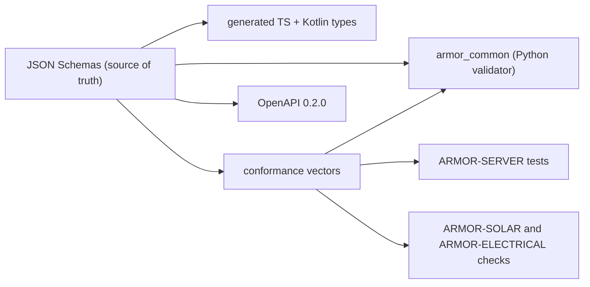

<p align="center">
  
</p>

# 🧾 ARMOR-COMMON

<p align="center">
  <a href="README.md">🇺🇸 English</a> |
  <a href="README_spa.md">🇪🇸 Español</a> |
  <a href="README_fra.md">🇫🇷 Français</a> |
  🇮🇹 <b>Italiano</b> |
  <a href="README_deu.md">🇩🇪 Deutsch</a> |
  <a href="README_zho.md">🇨🇳 简体中文</a> |
  <a href="README_jpn.md">🇯🇵 日本語</a>
</p>

### Contratti dei messaggi, validazione e lanciatore di progetti condiviso

<p align="center">
  
  
  
  
  
</p>

---

**Controllo di onestà - cosa funziona oggi:** Gli schemi, il validatore Python, i 330 vettori di conformità condivisi, i tipi TypeScript e Kotlin generati e il lanciatore di progetti condiviso sono reali e testati (36 test). Il file Kotlin è generato ma **non ancora usato** da ARMOR-ANDROID-CONTROL, e il comando `set_thresholds` porta un solo campo `sensitivity` perché i veri parametri del radar non sono definiti finché non esiste il firmware.

---

## 🎯 Panoramica

**ARMOR-COMMON** possiede il significato di ogni messaggio di A.R.M.O.R. I nodi radar, i nodi gateway solari e il simulatore producono questi messaggi; il server, l'IA visiva e il servizio vocale li consumano. Se due progetti non concordano su un campo, decide questo repository.

* **Un'unica fonte di verità:** schemi JSON in `src/armor_common/schemas/` per telemetria, salute, comando, informazioni del nodo e i due messaggi solari (inverter, batteria con celle e capacità). I campi sconosciuti sono rifiutati ovunque.
* **Un validatore che non può saltare una regola:** interpreta direttamente lo schema e rifiuta uno schema che usa una parola chiave che non implementa.
* **Vettori di conformità:** 330 payload accettati e rifiutati eseguiti da ogni implementazione (Python qui, TypeScript in ARMOR-SERVER, i controlli di ARMOR-SOLAR), così una deriva fa fallire la compilazione.
* **Client generati:** i tipi TypeScript e Kotlin nascono dagli schemi (`tools/generate_types.py --check` li mantiene aggiornati).
* **Contratto HTTP:** `openapi/armor-server-0.2.0.yaml` descrive ogni rotta del server, la sua regola di accesso e il suo schema.
* **Lanciatore condiviso:** `tools/armor_project_tool.py` dà a ogni repository della famiglia lo stesso flusso `build`, `build-test` e `run`.

## 🔄 Architettura



## 📂 Struttura del repository

```text
ARMOR-COMMON/
├── src/armor_common/   contracts, schema (validator), envelope, schemas/*.json (telemetry, health, command, info, solar_inverter, solar_battery, electrical)
├── conformance/        accepted and rejected payloads shared by every implementation
├── firmware_base/      the firmware that ARMOR-RADAR, ARMOR-SOLAR and ARMOR-ELECTRICAL share, once (synced into each by tools/sync_firmware_base.py)
├── generated/          TypeScript and Kotlin types (generated, do not edit)
├── openapi/            armor-server-0.2.0.yaml
├── tools/              armor_project_tool.py, generate_types.py, make_conformance.py, sync_firmware_base.py
├── tests/              unit tests and conformance runner
└── docs/               contracts guide, the shared firmware base
```

## 🛠️ Ambiente di sviluppo

```powershell
python -m pip install -e .
python -m unittest discover -s tests      # 39 tests, 330 conformance vectors
python tools/generate_types.py --check    # generated types are current
python tools/make_conformance.py          # regenerate the vectors after editing the case list
python tools/sync_firmware_base.py check  # the firmware the node projects share has not drifted (see docs/FIRMWARE_BASE.md)
```

Topic del broker: `armor/node/{node_id}/telemetry | health | command | info`, `armor/solar/{node_id}/{device}/state` e `armor/electrical/{node_id}/state | command | result`. Vedi la [guida ai contratti](docs/CONTRACTS.md). Il lanciatore condiviso crea un `.env` ignorato alla prima esecuzione di ARMOR-SERVER con segreti casuali e una password di amministratore casuale; nulla viene stampato né versionato.

## 🔗 Progetti correlati

**A.R.M.O.R.** (Autonomous Radar & Multimodal Observation Range) è un sistema di sicurezza perimetrale fatto di repository indipendenti. Ognuno ha la propria versione, i propri test e il proprio README; ecco la famiglia:

* **ARMOR-COMMON** (questo repository) - Contratti dei messaggi, validatori, vettori di conformità e tipi generati
* **[ARMOR-RADAR](../ARMOR-RADAR)** - Firmware del nodo di campo per ESP32-S3 con tre radar e un proprio pannello web
* **[ARMOR-SOLAR](../ARMOR-SOLAR)** - Protocolli di inverter e batterie solari e messaggi di un nodo gateway
* **[ARMOR-ELECTRICAL](../ARMOR-ELECTRICAL)** - Nodo elettrico: contatori, il messaggio delle letture della rete e le regole di manovra
* **[ARMOR-NETWORK](../ARMOR-NETWORK)** - La rete locale: i suoi dispositivi, internet e ciò che cambia
* **[ARMOR-SERVER](../ARMOR-SERVER)** - Coordinatore centrale: telemetria, allarmi, dispositivi, letture solari e telecamere
* **[ARMOR-STUDIO](../ARMOR-STUDIO)** - Console web: telecamere, radar, allarmi, energia solare e progettista del sito 2D/3D
* **[ARMOR-ANDROID-CONTROL](../ARMOR-ANDROID-CONTROL)** - Client Android dell'operatore con radar 2D/3D in tempo reale
* **[ARMOR-SERVER-AI](../ARMOR-SERVER-AI)** - Politica di inferenza visiva che spiega le sue decisioni e non agisce mai
* **[ARMOR-VOICE-AI](../ARMOR-VOICE-AI)** - Intenti vocali offline con una conferma impossibile da falsificare
* **[ARMOR-HARDWARE](../ARMOR-HARDWARE)** - Contenitori, elettronica e matrice di accettazione da banco
* **[ARMOR-DEVOPS](../ARMOR-DEVOPS)** - Distribuzione, banco di prova CM5, backup e TLS
* **[ARMOR-SIMULATOR](../ARMOR-SIMULATOR)** - Simulatore di telemetria offline con guasti ripetibili
* **[ARMOR-UPDATER](../ARMOR-UPDATER)** - Rileva, installa e aggiorna i repository stessi dell'ecosistema
* **[ARMOR-DOCS](../ARMOR-DOCS)** - Architettura, base di sicurezza e matrice delle capacità

## 📚 Documentazione e comunità

Dove leggere di più:

* [Matrice delle capacità: cosa è provato e cosa no](../ARMOR-DOCS/docs/CAPABILITY_MATRIX.md)
* [Catalogo dei progetti: versioni e dipendenze tra i repository](../ARMOR-DOCS/docs/PROJECT_CATALOG.md)
* [Cronologia delle modifiche di questo repository](CHANGELOG.md)
* [Licenza (GPL-3.0-or-later)](LICENSE)
* Domande, idee e segnalazioni: electrohobby3d@gmail.com

## 👤 AUTORE

**JuanenRac (Electro Hobby 3D)** · electrohobby3d@gmail.com

## 📜 LICENZA

GPL-3.0-or-later - vedi [LICENSE](LICENSE).
