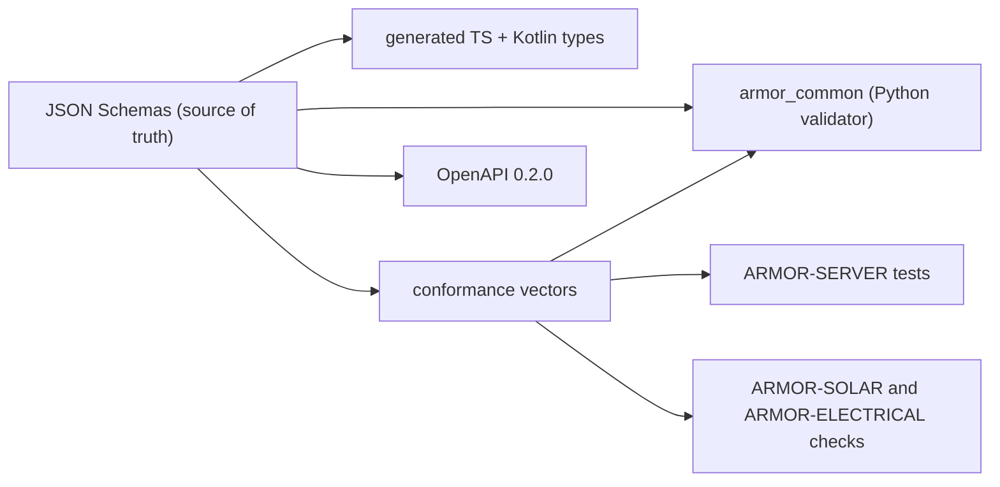

<p align="center">
  
</p>

# 🧾 ARMOR-COMMON

<p align="center">
  <a href="README.md">🇺🇸 English</a> |
  <a href="README_spa.md">🇪🇸 Español</a> |
  <a href="README_fra.md">🇫🇷 Français</a> |
  <a href="README_ita.md">🇮🇹 Italiano</a> |
  <a href="README_deu.md">🇩🇪 Deutsch</a> |
  <a href="README_zho.md">🇨🇳 简体中文</a> |
  🇯🇵 <b>日本語</b>
</p>

### メッセージ契約、検証、共有のプロジェクトランチャー

<p align="center">
  
  
  
  
  
</p>

---

**正直さのチェック - 今日動いているもの:** スキーマ、Python の検証器、共有の 330 件の適合性ベクトル、生成された TypeScript と Kotlin の型、共有のプロジェクトランチャーは実在し、テストされています（36 件）。Kotlin のファイルは生成されていますが ARMOR-ANDROID-CONTROL では**まだ使われておらず**、`set_thresholds` コマンドは `sensitivity` という 1 つのフィールドしか持ちません。実際のレーダーのパラメーターはファームウェアができるまで定義されないからです。

---

## 🎯 概要

**ARMOR-COMMON** は A.R.M.O.R. のすべてのメッセージの意味を所有します。レーダーノード、太陽光ゲートウェイノード、シミュレーターがこれらのメッセージを作り、サーバー、視覚 AI、音声サービスが使います。2 つのプロジェクトがフィールドについて食い違ったら、このリポジトリが決めます。

* **唯一の真実の源：** `src/armor_common/schemas/` の JSON スキーマ。テレメトリ、ヘルス、コマンド、ノード情報、そして 2 つの太陽光メッセージ（インバーター、セルと容量を持つバッテリー）。未知のフィールドはどこでも拒否されます。
* **規則を飛ばせない検証器：** スキーマを直接解釈し、実装していないキーワードを使うスキーマは拒否します。
* **適合性ベクトル：** 受理と拒否の 330 件のペイロードを、各実装（ここでは Python、ARMOR-SERVER では TypeScript、ARMOR-SOLAR のチェック）が実行するので、ずれるとビルドが失敗します。
* **生成されたクライアント：** TypeScript と Kotlin の型はスキーマから作られます（`tools/generate_types.py --check` が最新に保ちます）。
* **HTTP 契約：** `openapi/armor-server-0.4.2.yaml` は、サーバーのすべてのルート、そのアクセス規則、スキーマを記述します。
* **共有ランチャー：** `tools/armor_project_tool.py` は、ファミリーのすべてのリポジトリに同じ `build`、`build-test`、`run` の流れを与えます。

## 🔄 アーキテクチャ



## 📂 リポジトリの構成

```text
ARMOR-COMMON/
├── src/armor_common/   contracts, schema (validator), envelope, schemas/*.json (telemetry, health, command, info, solar_inverter, solar_battery, electrical)
├── conformance/        accepted and rejected payloads shared by every implementation
├── firmware_base/      the firmware that ARMOR-RADAR, ARMOR-SOLAR and ARMOR-ELECTRICAL share, once (synced into each by tools/sync_firmware_base.py)
├── generated/          TypeScript and Kotlin types (generated, do not edit)
├── openapi/            armor-server-0.4.2.yaml
├── tools/              armor_project_tool.py, generate_types.py, make_conformance.py, sync_firmware_base.py
├── tests/              unit tests and conformance runner
└── docs/               contracts guide, the shared firmware base
```

## 🛠️ 開発環境

```powershell
python -m pip install -e .
python -m unittest discover -s tests      # 39 tests, 330 conformance vectors
python tools/generate_types.py --check    # generated types are current
python tools/make_conformance.py          # regenerate the vectors after editing the case list
python tools/sync_firmware_base.py check  # the firmware the node projects share has not drifted (see docs/FIRMWARE_BASE.md)
```

ブローカーのトピック：`armor/node/{node_id}/telemetry | health | command | info`、`armor/solar/{node_id}/{device}/state`、`armor/electrical/{node_id}/state | command | result`。[契約ガイド](docs/CONTRACTS.md)を参照。共有ランチャーは ARMOR-SERVER の初回実行時に、ランダムなシークレットとランダムな管理者パスワードを持つ無視される `.env` を作ります。何も表示もコミットもされません。

## 🔗 関連プロジェクト

**A.R.M.O.R.**（Autonomous Radar & Multimodal Observation Range）は、独立したリポジトリで構成される周辺警備システムです。それぞれに独自のバージョン、テスト、README があります。ファミリーは次のとおりです：

* **ARMOR-COMMON** (このリポジトリ) - メッセージ契約、検証器、適合性ベクトル、生成された型
* **[ARMOR-RADAR](https://github.com/JuanenRac/ARMOR-RADAR)** - ESP32-S3 用フィールドノードのファームウェア。レーダー 3 基と独自の Web パネル付き
* **[ARMOR-SOLAR](https://github.com/JuanenRac/ARMOR-SOLAR)** - 太陽光インバーターとバッテリーのプロトコル、およびゲートウェイノードのメッセージ
* **[ARMOR-ELECTRICAL](https://github.com/JuanenRac/ARMOR-ELECTRICAL)** - 電気ノード：電力量計、電力網の計測メッセージ、開閉のルール
* **[ARMOR-HMI](https://github.com/JuanenRac/ARMOR-HMI)** - タッチパネル：壁面ディスプレイでのシステム状態表示、警戒・確認操作、音声アシスタントの拠点
* **[ARMOR-NETWORK](https://github.com/JuanenRac/ARMOR-NETWORK)** - ローカルネットワーク：機器、インターネット、そして変化
* **[ARMOR-SERVER](https://github.com/JuanenRac/ARMOR-SERVER)** - 中央コーディネーター：テレメトリ、アラーム、デバイス、太陽光の測定値、カメラ
* **[ARMOR-STUDIO](https://github.com/JuanenRac/ARMOR-STUDIO)** - Web コンソール：カメラ、レーダー、アラーム、太陽光発電、2D/3D サイト設計
* **[ARMOR-ANDROID-CONTROL](https://github.com/JuanenRac/ARMOR-ANDROID-CONTROL)** - リアルタイム 2D/3D レーダー付きの Android オペレータークライアント
* **[ARMOR-SERVER-AI](https://github.com/JuanenRac/ARMOR-SERVER-AI)** - 判断を説明し、決して動作しない視覚推論ポリシー
* **[ARMOR-VOICE-AI](https://github.com/JuanenRac/ARMOR-VOICE-AI)** - 偽造できない確認を備えたオフライン音声インテント
* **[ARMOR-HARDWARE](https://github.com/JuanenRac/ARMOR-HARDWARE)** - 筐体、電子部品、ベンチ受け入れマトリクス
* **[ARMOR-DEVOPS](https://github.com/JuanenRac/ARMOR-DEVOPS)** - デプロイ、CM5 テストベンチ、バックアップ、TLS
* **[ARMOR-SIMULATOR](https://github.com/JuanenRac/ARMOR-SIMULATOR)** - 再現可能な故障を備えたオフラインのテレメトリシミュレーター
* **[ARMOR-UPDATER](https://github.com/JuanenRac/ARMOR-UPDATER)** - エコシステム自身のリポジトリを検出し、インストールし、更新する
* **[ARMOR-DOCS](https://github.com/JuanenRac/ARMOR-DOCS)** - アーキテクチャ、セキュリティ基準、機能マトリクス

## 📚 ドキュメントとコミュニティ

詳しくは：

* [機能マトリクス：実証済みのものとそうでないもの](https://github.com/JuanenRac/ARMOR-DOCS/blob/main/docs/CAPABILITY_MATRIX.md)
* [プロジェクト一覧：バージョンとリポジトリ間の依存関係](https://github.com/JuanenRac/ARMOR-DOCS/blob/main/docs/PROJECT_CATALOG.md)
* [このリポジトリの変更履歴](CHANGELOG.md)
* [ライセンス（GPL-3.0-or-later）](LICENSE)
* 質問・提案・報告：electrohobby3d@gmail.com

## 👤 作者

**JuanenRac (Electro Hobby 3D)** · electrohobby3d@gmail.com

## 📜 ライセンス

GPL-3.0-or-later - [LICENSE](LICENSE) を参照。
