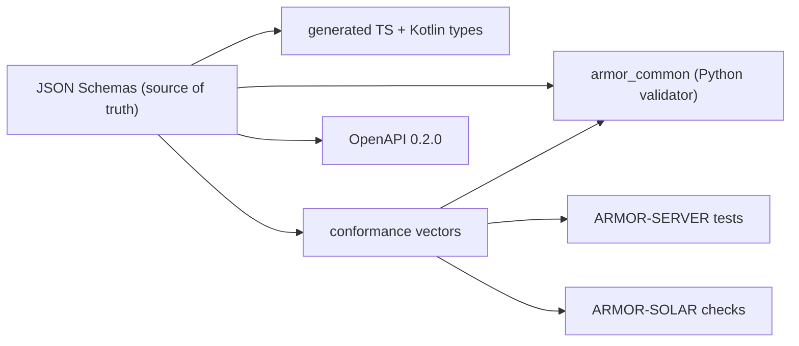

<p align="center">
  
</p>

# 🧾 ARMOR-COMMON

<p align="center">
  <a href="README.md">🇺🇸 English</a> |
  🇪🇸 <b>Español</b> |
  <a href="README_fra.md">🇫🇷 Français</a> |
  <a href="README_ita.md">🇮🇹 Italiano</a> |
  <a href="README_deu.md">🇩🇪 Deutsch</a> |
  <a href="README_zho.md">🇨🇳 简体中文</a> |
  <a href="README_jpn.md">🇯🇵 日本語</a>
</p>

### Contratos de mensajes, validación y el lanzador de proyectos compartido

<p align="center">
  
  
  
  
  
</p>

---

**Comprobación de honestidad - qué funciona hoy:** Los esquemas, el validador de Python, los 177 vectores de conformidad compartidos, los tipos generados de TypeScript y Kotlin y el lanzador de proyectos compartido son reales y están probados (19 pruebas). El archivo de Kotlin está generado pero **aún no lo usa** ARMOR-ANDROID-CONTROL, y el comando `set_thresholds` lleva un único campo `sensitivity` porque los parámetros reales del radar no se definen hasta que exista firmware.

---

## 🎯 Descripción general

**ARMOR-COMMON** es dueño de lo que significa cada mensaje de A.R.M.O.R. Los nodos de radar, los nodos pasarela solares y el simulador producen estos mensajes; el servidor, la IA visual y el servicio de voz los consumen. Si dos proyectos discrepan sobre un campo, decide este repositorio.

* **Una única fuente de verdad:** esquemas JSON en `src/armor_common/schemas/` para telemetría, salud, comando, información del nodo y los dos mensajes solares (inversor, batería con celdas y capacidades). Los campos desconocidos se rechazan en todas partes.
* **Un validador que no puede saltarse una regla:** interpreta el esquema directamente y rechaza un esquema que use una palabra clave que no implementa.
* **Vectores de conformidad:** 177 cargas aceptadas y rechazadas que ejecuta cada implementación (Python aquí, TypeScript en ARMOR-SERVER, las comprobaciones de ARMOR-SOLAR), de modo que una deriva rompe la compilación.
* **Clientes generados:** los tipos de TypeScript y Kotlin salen de los esquemas (`tools/generate_types.py --check` los mantiene al día).
* **Contrato HTTP:** `openapi/armor-server-0.2.0.yaml` describe cada ruta del servidor, su regla de acceso y su esquema.
* **Lanzador compartido:** `tools/armor_project_tool.py` da a todos los repositorios de la familia el mismo flujo `build`, `build-test` y `run`.

## 🔄 Arquitectura



## 📂 Estructura del repositorio

```text
ARMOR-COMMON/
├── src/armor_common/   contracts, schema (validator), envelope, schemas/*.json (telemetry, health, command, info, solar_inverter, solar_battery)
├── conformance/        accepted and rejected payloads shared by every implementation
├── generated/          TypeScript and Kotlin types (generated, do not edit)
├── openapi/            armor-server-0.2.0.yaml
├── tools/              armor_project_tool.py, generate_types.py, make_conformance.py
├── tests/              unit tests and conformance runner
└── docs/               contracts guide
```

## 🛠️ Entorno de desarrollo

```powershell
python -m pip install -e .
python -m unittest discover -s tests      # 19 tests, 177 conformance vectors
python tools/generate_types.py --check    # generated types are current
python tools/make_conformance.py          # regenerate the vectors after editing the case list
```

Temas del broker: `armor/node/{node_id}/telemetry | health | command | info` y `armor/solar/{node_id}/{device}/state`. Véase la [guía de contratos](docs/CONTRACTS.md). El lanzador compartido crea un `.env` ignorado en la primera ejecución de ARMOR-SERVER con secretos aleatorios y una contraseña de administrador aleatoria; no se imprime ni se sube nada.

## 🔗 Proyectos relacionados

**A.R.M.O.R.** (Autonomous Radar & Multimodal Observation Range) es un sistema de seguridad perimetral hecho de repositorios independientes. Cada uno tiene su propia versión, sus propias pruebas y su propio README; esta es la familia:

* **ARMOR-COMMON** (este repositorio) - Contratos de mensajes, validadores, vectores de conformidad y tipos generados
* **[ARMOR-RADAR](../ARMOR-RADAR)** - Firmware del nodo de campo para ESP32-S3 con tres radares y su propio panel web
* **[ARMOR-SOLAR](../ARMOR-SOLAR)** - Protocolos de inversores y baterías solares y los mensajes de un nodo pasarela
* **[ARMOR-SERVER](../ARMOR-SERVER)** - Coordinador central: telemetría, alarmas, dispositivos, lecturas solares y cámaras
* **[ARMOR-STUDIO](../ARMOR-STUDIO)** - Consola web: cámaras, radar, alarmas, energía solar y el diseñador de sitio 2D/3D
* **[ARMOR-ANDROID-CONTROL](../ARMOR-ANDROID-CONTROL)** - Cliente Android del operador con radar 2D/3D en vivo
* **[ARMOR-SERVER-AI](../ARMOR-SERVER-AI)** - Política de inferencia visual que explica sus decisiones y nunca actúa
* **[ARMOR-VOICE-AI](../ARMOR-VOICE-AI)** - Intenciones de voz sin conexión con una confirmación imposible de falsificar
* **[ARMOR-HARDWARE](../ARMOR-HARDWARE)** - Cajas, electrónica y la matriz de aceptación en banco
* **[ARMOR-DEVOPS](../ARMOR-DEVOPS)** - Despliegue, el banco de pruebas de la CM5, copias de seguridad y TLS
* **[ARMOR-SIMULATOR](../ARMOR-SIMULATOR)** - Simulador de telemetría sin conexión con fallos repetibles
* **[ARMOR-DOCS](../ARMOR-DOCS)** - Arquitectura, base de seguridad y la matriz de capacidades

## 📚 Documentación y comunidad

Dónde leer más:

* [Matriz de capacidades: qué está probado y qué no](../ARMOR-DOCS/docs/CAPABILITY_MATRIX.md)
* [Catálogo de proyectos: versiones y cómo dependen unos de otros](../ARMOR-DOCS/docs/PROJECT_CATALOG.md)
* [Historial de cambios de este repositorio](CHANGELOG.md)
* [Licencia (GPL-3.0-or-later)](LICENSE)
* Preguntas, ideas e informes: electrohobby3d@gmail.com

## 👤 AUTOR

**JuanenRac (Electro Hobby 3D)** · electrohobby3d@gmail.com

## 📜 LICENCIA

GPL-3.0-or-later - véase [LICENSE](LICENSE).
