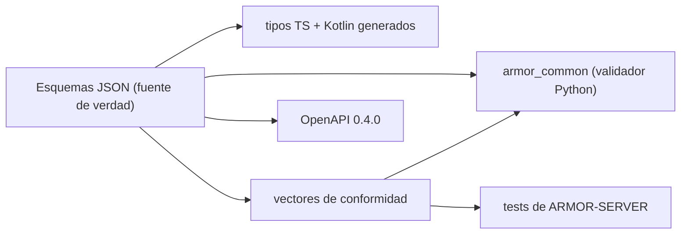

<p align="center">
  
</p>

# 📐 ARMOR-COMMON

<p align="center"><a href="README.md">🇺🇸 English</a> | 🇪🇸 <b>Español</b></p>

### 🧾 Contratos de mensajes, validación y lanzador de proyectos compartido

<p align="center">
  
  
  
  
</p>

---

**Comprobación de honestidad - qué funciona hoy:** los esquemas, el validador Python, los 50 vectores de conformidad compartidos, los tipos TypeScript y Kotlin generados y el lanzador de proyectos son reales y están probados. El archivo Kotlin está generado pero **todavía no lo consume** ARMOR-ANDROID-CONTROL, y el comando `set_thresholds` lleva un único campo `sensitivity` porque los parámetros reales del radar no se definen hasta que exista el firmware.

---

## 1. 🛠️ DESCRIPCIÓN

**ARMOR-COMMON** es dueño del significado de cada mensaje de A.R.M.O.R. Los nodos de radar y el simulador producen estos mensajes; el servidor, la IA visual y el servicio de voz los consumen. Si dos proyectos discrepan sobre un campo, decide este repositorio.

* 📜 **Una única fuente de verdad:** esquemas JSON en `src/armor_common/schemas/` (telemetría, salud, comando). Los campos desconocidos se rechazan en todas partes.
* ✅ **Un validador que no puede saltarse una regla:** interpreta el esquema directamente y rechaza un esquema que use una palabra clave que no implementa.
* 🤝 **Vectores de conformidad:** 50 cargas aceptadas o rechazadas que ejecuta cada implementación (Python aquí, TypeScript en ARMOR-SERVER), de modo que una divergencia rompe la compilación.
* 🧬 **Clientes generados:** los tipos TypeScript y Kotlin salen de los esquemas (`tools/generate_types.py --check` los mantiene al día).
* 🌐 **Contrato HTTP:** `openapi/armor-server-0.4.0.yaml` describe cada ruta del servidor, su regla de acceso y su esquema.
* 🚀 **Lanzador compartido:** `tools/armor_project_tool.py` da a los once repositorios el mismo flujo `build`, `build-test` y `run`.

---

## 2. 🔄 ARQUITECTURA



Topics del broker: `armor/node/{node_id}/telemetry | health | command`. Véase [contratos](docs/CONTRACTS.md).

---

## 3. 🔧 COMPILAR Y PROBAR

```powershell
python -m pip install -e .
python -m unittest discover -s tests      # 16 tests, 50 vectores de conformidad
python tools/generate_types.py --check    # los tipos generados están al día
python tools/make_conformance.py          # regenerar los vectores tras editar la lista de casos
```

El lanzador compartido crea un `.env` ignorado en la primera ejecución de ARMOR-SERVER con secretos aleatorios de ingesta, control, operador y clave de cámaras, más un usuario `admin` de Studio y una contraseña aleatoria. No se imprime ni se sube nada; lee o sustituye esos valores solo en el `.env` del servidor.

---

## 📂 ESTRUCTURA DE DIRECTORIOS

```text
ARMOR-COMMON/
├── src/armor_common/   contracts, schema (validador), envelope, schemas/*.json
├── conformance/        cargas aceptadas y rechazadas compartidas por todas las implementaciones
├── generated/          tipos TypeScript y Kotlin (generados, no editar)
├── openapi/            armor-server-0.4.0.yaml
├── tools/              armor_project_tool.py, generate_types.py, make_conformance.py
├── tests/              tests unitarios y ejecutor de conformidad
└── docs/               guía de contratos
```

---

## 👤 AUTOR

**JuanenRac (Electro Hobby 3D)** · electrohobby3d@gmail.com

## 📜 LICENCIA

GPL-3.0-or-later - véase [LICENSE](LICENSE).
