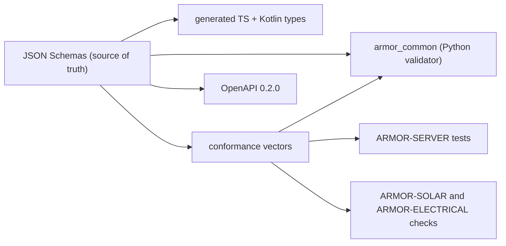

<p align="center">
  
</p>

# 🧾 ARMOR-COMMON

<p align="center">
  <a href="README.md">🇺🇸 English</a> |
  <a href="README_spa.md">🇪🇸 Español</a> |
  <a href="README_fra.md">🇫🇷 Français</a> |
  <a href="README_ita.md">🇮🇹 Italiano</a> |
  <a href="README_deu.md">🇩🇪 Deutsch</a> |
  🇨🇳 <b>简体中文</b> |
  <a href="README_jpn.md">🇯🇵 日本語</a>
</p>

### 消息契约、验证和共享的项目启动器

<p align="center">
  
  
  
  
  
</p>

---

**诚实性检查 - 今天真正能运行的部分:** 模式、Python 验证器、330 个共享的一致性向量、生成的 TypeScript 和 Kotlin 类型以及共享的项目启动器都是真实的并经过测试（36 个测试）。Kotlin 文件已生成，但 ARMOR-ANDROID-CONTROL **尚未使用**；`set_thresholds` 命令只带一个 `sensitivity` 字段，因为在固件存在之前，真实的雷达参数尚未定义。

---

## 🎯 概述

**ARMOR-COMMON** 掌管每条 A.R.M.O.R. 消息的含义。雷达节点、太阳能网关节点和模拟器产生这些消息；服务器、视觉 AI 和语音服务消费它们。如果两个项目对某个字段有分歧，由本仓库裁决。

* **唯一的事实来源：** `src/armor_common/schemas/` 中的 JSON 模式，涵盖遥测、健康、命令、节点信息和两条太阳能消息（逆变器、带电芯和容量的电池）。未知字段在所有地方都会被拒绝。
* **不会跳过任何规则的验证器：** 它直接解释模式，并拒绝使用其未实现关键字的模式。
* **一致性向量：** 330 个被接受和被拒绝的负载，由每个实现运行（此处的 Python、ARMOR-SERVER 中的 TypeScript、ARMOR-SOLAR 的检查），因此偏差会让构建失败。
* **生成的客户端：** TypeScript 和 Kotlin 类型来自模式（`tools/generate_types.py --check` 使其保持最新）。
* **HTTP 契约：** `openapi/armor-server-0.2.0.yaml` 描述服务器的每条路由、其访问规则和模式。
* **共享启动器：** `tools/armor_project_tool.py` 让家族中的每个仓库都有相同的 `build`、`build-test` 和 `run` 流程。

## 🔄 架构



## 📂 仓库结构

```text
ARMOR-COMMON/
├── src/armor_common/   contracts, schema (validator), envelope, schemas/*.json (telemetry, health, command, info, solar_inverter, solar_battery, electrical)
├── conformance/        accepted and rejected payloads shared by every implementation
├── firmware_base/      the firmware that ARMOR-RADAR, ARMOR-SOLAR and ARMOR-ELECTRICAL share, once (synced into each by tools/sync_firmware_base.py)
├── generated/          TypeScript and Kotlin types (generated, do not edit)
├── openapi/            armor-server-0.2.0.yaml
├── tools/              armor_project_tool.py, generate_types.py, make_conformance.py, sync_firmware_base.py
├── tests/              unit tests and conformance runner
└── docs/               contracts guide, the shared firmware base
```

## 🛠️ 开发环境

```powershell
python -m pip install -e .
python -m unittest discover -s tests      # 39 tests, 330 conformance vectors
python tools/generate_types.py --check    # generated types are current
python tools/make_conformance.py          # regenerate the vectors after editing the case list
python tools/sync_firmware_base.py check  # the firmware the node projects share has not drifted (see docs/FIRMWARE_BASE.md)
```

代理主题：`armor/node/{node_id}/telemetry | health | command | info`、`armor/solar/{node_id}/{device}/state` 和 `armor/electrical/{node_id}/state | command | result`。参见[契约指南](docs/CONTRACTS.md)。共享启动器在 ARMOR-SERVER 首次运行时创建被忽略的 `.env`，含随机机密和随机的管理员密码；不会打印或提交任何内容。

## 🔗 相关项目

**A.R.M.O.R.**（Autonomous Radar & Multimodal Observation Range）是由若干独立仓库组成的周界安防系统。每个仓库都有自己的版本、测试和 README；家族成员如下：

* **ARMOR-COMMON** (本仓库) - 消息契约、验证器、一致性向量和生成的类型
* **[ARMOR-RADAR](https://github.com/JuanenRac/ARMOR-RADAR)** - 适用于 ESP32-S3 的现场节点固件，带三个雷达和自带网页面板
* **[ARMOR-SOLAR](https://github.com/JuanenRac/ARMOR-SOLAR)** - 太阳能逆变器与电池的协议，以及网关节点的消息
* **[ARMOR-ELECTRICAL](https://github.com/JuanenRac/ARMOR-ELECTRICAL)** - 电气节点：电表、电网读数消息和开关规则
* **[ARMOR-HMI](https://github.com/JuanenRac/ARMOR-HMI)** - 触摸面板：墙面屏幕上的系统状态、布防与确认，以及语音助手的所在
* **[ARMOR-NETWORK](https://github.com/JuanenRac/ARMOR-NETWORK)** - 本地网络：其设备、互联网以及变化
* **[ARMOR-SERVER](https://github.com/JuanenRac/ARMOR-SERVER)** - 中央协调器：遥测、报警、设备、太阳能读数和摄像头
* **[ARMOR-STUDIO](https://github.com/JuanenRac/ARMOR-STUDIO)** - 网页控制台：摄像头、雷达、报警、太阳能和 2D/3D 场地设计器
* **[ARMOR-ANDROID-CONTROL](https://github.com/JuanenRac/ARMOR-ANDROID-CONTROL)** - 带实时 2D/3D 雷达的 Android 操作员客户端
* **[ARMOR-SERVER-AI](https://github.com/JuanenRac/ARMOR-SERVER-AI)** - 会解释决策且从不执行动作的视觉推理策略
* **[ARMOR-VOICE-AI](https://github.com/JuanenRac/ARMOR-VOICE-AI)** - 带无法伪造确认的离线语音意图
* **[ARMOR-HARDWARE](https://github.com/JuanenRac/ARMOR-HARDWARE)** - 外壳、电子器件和台架验收矩阵
* **[ARMOR-DEVOPS](https://github.com/JuanenRac/ARMOR-DEVOPS)** - 部署、CM5 测试台、备份与 TLS
* **[ARMOR-SIMULATOR](https://github.com/JuanenRac/ARMOR-SIMULATOR)** - 带可重复故障的离线遥测模拟器
* **[ARMOR-UPDATER](https://github.com/JuanenRac/ARMOR-UPDATER)** - 发现、安装并更新生态系统自身的仓库
* **[ARMOR-DOCS](https://github.com/JuanenRac/ARMOR-DOCS)** - 架构、安全基线和能力矩阵

## 📚 文档与社区

更多阅读：

* [能力矩阵：哪些已被证实，哪些没有](https://github.com/JuanenRac/ARMOR-DOCS/blob/main/docs/CAPABILITY_MATRIX.md)
* [项目目录：版本以及各仓库之间的依赖](https://github.com/JuanenRac/ARMOR-DOCS/blob/main/docs/PROJECT_CATALOG.md)
* [本仓库的变更记录](CHANGELOG.md)
* [许可证（GPL-3.0-or-later）](LICENSE)
* 问题、想法与反馈：electrohobby3d@gmail.com

## 👤 作者

**JuanenRac (Electro Hobby 3D)** · electrohobby3d@gmail.com

## 📜 许可证

GPL-3.0-or-later - 见 [LICENSE](LICENSE)。
